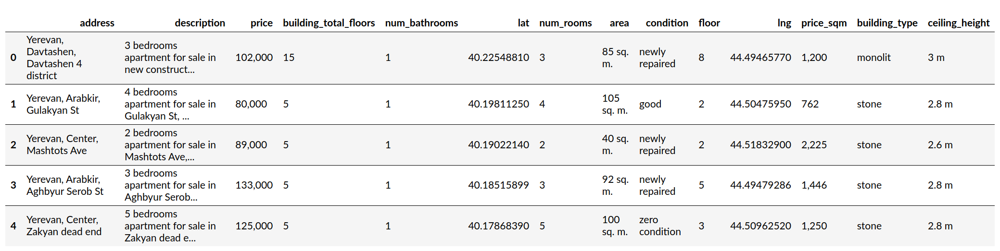
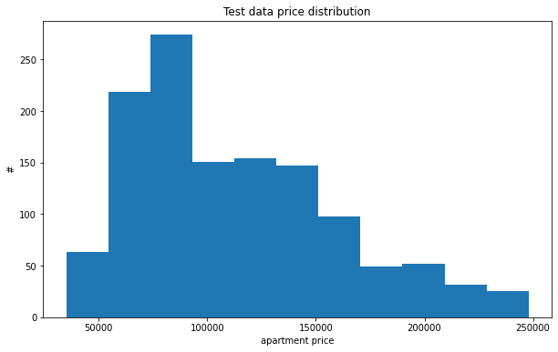

# ML101 Practial 1 - Apartments

In this exercise we are going to try to predict apartment prices in Yerevan. It should be simple, right? ;) The bigger the apartment, the higher the price! But by how much?

The practical focuses on achieving good predictive results. Probably having 20,000 USD error margin is good, anything higher than that, your model probably isn't worth much. So spend some time improving the features you create, and try to get the error score lower, but remember not to overfit to the training data!

## The data

We are given a data for apartment prices in Yerevan. Here is a snapshot:


The data is stored in a csv file `data/yerevan_may_2020.csv.gz` (it is gzipped so that it doesn't take much space)

## Process
We are going to write a fit_linear_regression function and helpers similar to Homework 1 (your code from there should work). This will be in `practical1/regression.py`

Also we need to convert the data into a vector, the raw data has the following structure:
```
{
    'address': 'Yerevan, Davtashen, Davtashen 4 district',
    'description': '3 bedrooms apartment for sale in Davtashen 4 district, Davtashen, Yerevan',
    'building_total_floors': '15',
    'num_bathrooms': '1',
    'lat': '40.22548810',
    'num_rooms': '3',
    'area': '85 sq. m.',
    'condition': 'newly repaired',
    'floor': '8',
    'lng': '44.49465770',
    'building_type': 'monolit',
    'ceiling_height': '3 m'
}

```

Our algorithm works with vectors (`np.ndarray`), so we have to have a function that converts the dictionary into a vector (`featurize`). This process is called [Feature Engineering](https://en.wikipedia.org/wiki/Feature_engineering) and plays a big part in machine learning. This is your first intorduction to it. Be creative, but make sure your features make sense, because you don't want to overfit your model.

Once you can train a model, it's time to train a better model. You should use the code `practical/search.py` to find good hyperparameters and even find a good featurize function! Cross validation might come in handy.

### To get good score, you need to understand the data well.


### Deliverables and Grading

Runing `save_beta.py` will overwrite `beta.json`, this will be important! We are going to use that number, instead of running your algorithm to find the beta.
```
python save_beta.py
```

This is an open ended problem, you will be scored on the following:
    - half of the points will be determined using **our** unit tests.
    - half of the points will be determined using the goodness of the fit on held out data.
    
This means that we have kept some apartments secret from you, and we will test your model, using your `featurize` function and your `beta.json` to predict the prices on those apartments, and closer your model predicts the better for you.

Make sure your code can featurize the entire dataset! You can check it using the following command:
```
python score.py --data data/yerevan_may_2020.csv.gz
```

#### Test data

Test data is a nicer data set than we have given to you. It has the following properties:
  - There are no commercial properties (as marked in your dataset) in the test data!
  - There are no super cheap or very expensive apartments. price is in 30,000-250,000 range.
      * You'll have to think creatively how to use the rest of the data to your advantage.

Here is the price histogram of the test data set.


